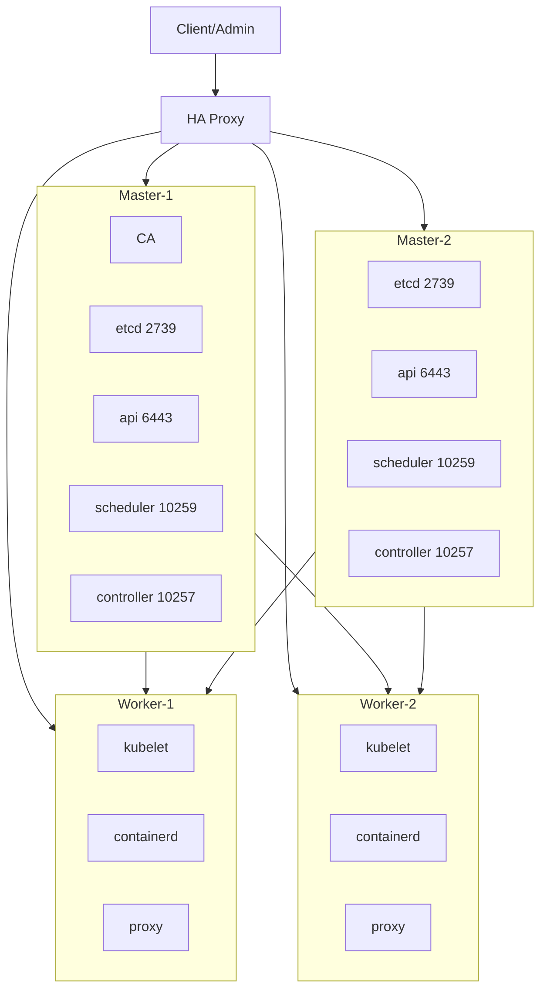

# Build K8s manually
## Description
This Repo contains Ansible playbooks to provision Kuberentes cluster.
### Diagram 


## Usage
### Ansible hosts file

* Add the ansible hosts file:
```
sudo vim /etc/ansible/hosts
```
Content:
```
[k8s]
master-1
master-2
worker-1
worker-2

[masters]
master-1
master-2

[workers]
worker-1
worker-2
```
* Make sure your systems hosts file is correct:
Example:
```
10.171.176.131 master-1
10.171.176.132 master-2
10.171.176.133 worker-1
10.171.176.134 worker-2
10.171.176.130 loadbalancer
```

### Clean-up existing environment

This script stops all k8s daemons, removes directories and all configs and certs:
```
sudo ./clean-up.sh stop
```

### Execute Ansible playbooks

Run each playbook manually:
```
ansible-playbook --ask-become-pass 01-pki.yml
```
### Workflow


# Credits
Build Kubernetes Hardway
https://github.com/kelseyhightower/kubernetes-the-hard-way
